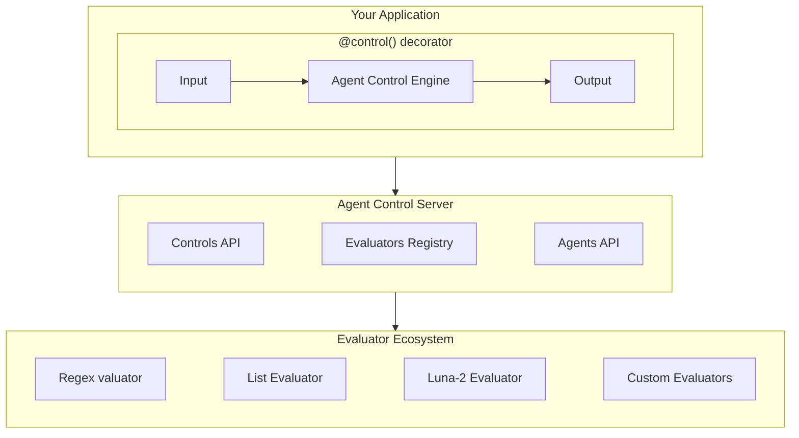
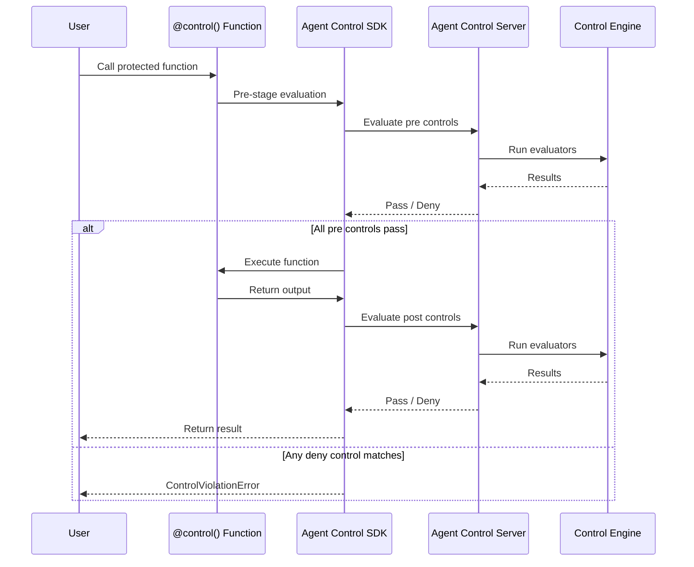

## System Overview



## Components

| Package | Description |
|:--------|:------------|
| [`agent-control-sdk`](/sdk/python-sdk) | Python SDK with `@control()` decorator |
| `agent-control-server` | FastAPI server with Control Management API |
| `agent-control-engine` | Core evaluation logic and evaluator system |
| `agent-control-models` | Shared Pydantic v2 models |
| `agent-control-evaluators` | Built-in evaluators |

### User Application Layer

- **Your AI Agent Application** — Any Python application using AI agents (LangChain, CrewAI, custom, etc.)
- **Agent Control SDK** — Python package with `@control()` decorator for protecting functions

### Server Layer

- **REST API Server** — FastAPI-based server exposing control management endpoints
- **Authentication** — Optional API key authentication for production deployments

### Processing Layer

- **Control Engine** — Core evaluation engine that processes control rules and evaluates data
- **Evaluator Registry** — Plugin system for discovering and loading evaluators via entry points

### Evaluator Ecosystem

- **Built-in Evaluators** — Out-of-the-box evaluators (regex, list matching, JSON validation, SQL injection detection)
- **Luna-2 Evaluator** — AI-powered detection using Galileo's Luna-2 API
- **Custom Evaluators** — User-defined evaluators extending the base `Evaluator` class

### Data Layer

- **PostgreSQL** — Persistent storage for controls, agents, and observability data
- **Shared Models** — Pydantic v2 models shared across all components

---

## Data Flow

### Agent Initialization

1. **Agent Registration** — Agent initializes with `agent_control.init()`, registering with the server
2. **Policy Assignment** — Server returns the agent's assigned policy and active controls

### Control Execution



### Control Management

1. **User Configures** — Admin uses Web Dashboard or API to create/modify controls
2. **Server Stores** — Server validates and stores control configuration in database
3. **Runtime Updates** — Changes take effect immediately for new requests (no deployment needed)
4. **Observability** — All control executions are logged for monitoring and analysis

---

## Directory Structure

```bash
agent-control/
├── sdks/python/     # Python SDK (agent-control-sdk)
├── server/          # FastAPI server (agent-control-server)
├── engine/          # Evaluation engine (agent-control-engine)
├── models/          # Shared models (agent-control-models)
├── evaluators/      # Evaluator implementations (agent-control-evaluators)
├── ui/              # Next.js web dashboard
└── examples/        # Usage examples
```

## Key Design Decisions

- **Runtime Configuration** — Update controls without redeploying applications
- **Extensible** — Plugin architecture for custom evaluators
- **Fail-Safe** — Configurable error handling (fail open/closed)
- **Observable** — Full audit trail of control executions
- **Production-Ready** — API authentication, PostgreSQL, horizontal scaling support
