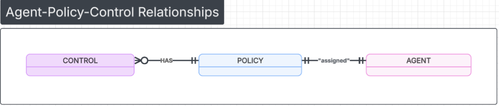

A Policy is a named collection of controls assigned to an agent. Policies enable you to:

- Bundle multiple controls together as a cohesive protection strategy
- Audit your safety rules
- Enables reusable security/compliance configurations across agents
- Apply different policies to different environments (dev/staging/prod)

```python
# Policy for PROD deployment
{
  "id": 42,
  "name": "production-safety",
  "controls": [ # collection of rules.
    {....}
  ]
}
```
