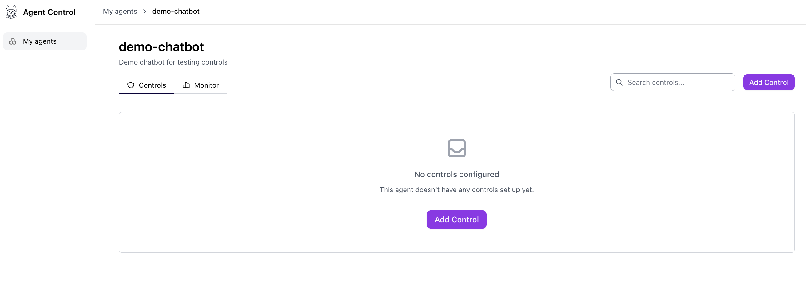
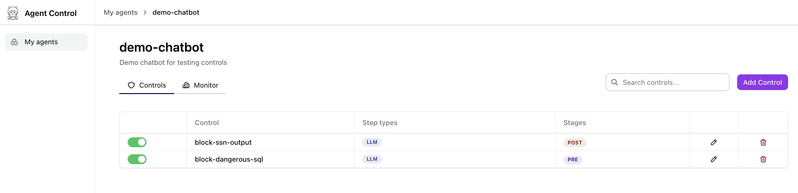
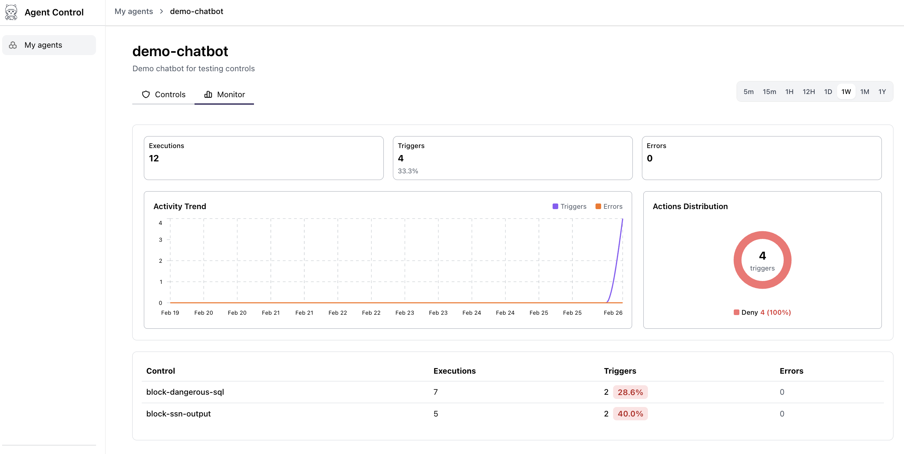

Protect your AI agent in 4 steps: start the server → run the demo once → add controls → rerun to verify blocking.

## Prerequisites

Python 3.12+

uv — fast Python package manager

```bash
curl -LsSf https://astral.sh/uv/install.sh | sh
```

Docker — for running PostgreSQL

Node.js 18+ — only if you want the web dashboard (optional)

<Steps>
<Step title="Start the Agent Control server">
The server stores policies/controls and evaluates agent operations for safety.

```bash
# Clone the repository (contains the server and examples)
git clone https://github.com/agentcontrol/agent-control.git
cd agent-control

# Install dependencies (creates/uses the repo environment)
make sync

# Start PostgreSQL database
cd server
docker-compose up -d
cd ..

# Run database migrations
make server-alembic-upgrade

# Start the Agent Control server
make server-run
```

✅ Server runs at [http://localhost:8000](http://localhost:8000)

Verify it’s up: open [http://localhost:8000/health](http://localhost:8000/health) and confirm you see `{"status": "ok"}`.
</Step>

<Step title="Run the demo agent (no server-side controls yet)">
This demo agent includes @control() decorators and runs a set of test scenarios.

```bash
uv run python examples/agent_control_demo/demo_agent.py
```

At this point you may see a message like “No controls returned from server”. That’s expected until you add controls.
</Step>

<Step title="Start the web dashboard (optional)">
If you want to see controls in the UI, start the dashboard in a separate terminal:

```bash
cd ui
pnpm install
pnpm dev
```

✅ Dashboard runs at [http://localhost:4000](http://localhost:4000)

If you open the UI now, you won't see any controls yet—those are created in the next step.



The dashboard starts with an empty state because no controls or policies have been registered with the server yet. Once you add controls in the next step, they appear here automatically.
</Step>

<Step title="Add controls + policy (server-side)">
Run the included setup script to:

- Register the demo agent (demo-chatbot)
- Create two controls:
       - block-ssn-output (regex) — blocks SSNs in output (post stage)
       - block-dangerous-sql (list) — blocks dangerous SQL keywords in input (pre stage)
- Create a policy (demo-policy) and assign it to the demo agent

```bash
uv run python examples/agent_control_demo/setup_controls.py
```

You should see output confirming control creation, policy creation, and assignment to the agent.
</Step>

<Step title="Rerun the demo agent (controls loaded from the server)">
Run the demo again. This time it should load controls from the server and block unsafe behavior.

```bash
uv run python examples/agent_control_demo/demo_agent.py
```

✅ Expected behavior on rerun:

- Safe requests pass through
- 🚫 Dangerous SQL (e.g., DROP TABLE, DELETE FROM …) is blocked before execution (pre)
- 🚫 SSNs in the response are blocked after execution (post)

With controls loaded, the UI will show the configured controls and their monitoring view:



The controls list view displays each registered control with its name, evaluation stage (`pre` or `post`), evaluator type, and the policy it belongs to. In this demo, you should see `block-ssn-output` (post stage, regex evaluator) and `block-dangerous-sql` (pre stage, list evaluator), both assigned to `demo-policy`.



The monitoring dashboard shows real-time activity for each control — including how many requests were evaluated, how many were blocked, and the pass/block ratio. Use this view to verify that dangerous SQL queries and SSN-containing responses are being caught as expected.
</Step>
</Steps>

## Optional: Update Controls and Rerun

To modify the demo controls (for example, add more blocked SQL keywords), run:

```bash
uv run python examples/agent_control_demo/update_controls.py
```

Then rerun the demo agent to see the updated control behavior:

```bash
uv run python examples/agent_control_demo/demo_agent.py
```
