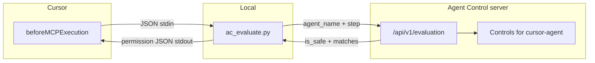

[Cursor hooks](https://cursor.com/docs/agent/hooks) run external commands around the agent loop. This guide wires `beforeMCPExecution` to Agent Control's evaluation API to govern what the Cursor agent can do through the [GitHub MCP server](https://github.com/github/github-mcp-server).

Cursor has a built-in MCP allowlist, but it is per-machine and per-developer; there is no central place to manage policy across an organization. Agent Control adds that central layer, giving you one place to manage rules for Cursor, your own agents, and any other Agent Control-integrated tool.

By the end of this guide you will have:

- A hook script that evaluates every GitHub MCP call against Agent Control before it runs
- A control that blocks write operations while leaving read tools open
- A working end-to-end test you can trigger with a natural language prompt in Cursor

## How it works



Cursor passes the hook payload as JSON on stdin. The script maps it to a **tool step** and calls `POST /api/v1/evaluation`. Agent Control evaluates the step against the controls linked to your `cursor-agent` and returns `is_safe`. The script writes `{"permission": "allow"}` or `{"permission": "deny"}` to stdout.

## Prerequisites

- [Cursor](https://cursor.com) installed (v0.48.0 or later)
- Agent Control **server** running and reachable from your machine
- **Python 3** on your PATH as `python3` (stdlib only — no extra packages needed)
- For authenticated servers: an API key ([authentication guide](/how-to/enable-authentication))

### Set up GitHub MCP

If you haven't already, add the GitHub MCP server to `~/.cursor/mcp.json`:

```json
{
  "mcpServers": {
    "github": {
      "url": "https://api.githubcopilot.com/mcp/",
      "headers": {
        "Authorization": "Bearer YOUR_GITHUB_PAT"
      }
    }
  }
}
```

Replace `YOUR_GITHUB_PAT` with a GitHub Personal Access Token that has repository permissions. Restart Cursor and confirm the server shows a green indicator under **Settings → Tools & Integrations → MCP Tools**.

See the [GitHub MCP installation guide](https://github.com/github/github-mcp-server/blob/main/docs/installation-guides/install-cursor.md) for more detail.

## 1. Create the hook script

Create `~/.cursor/hooks/ac_evaluate.py`:

```python
#!/usr/bin/env python3
"""
Cursor hook: evaluates beforeMCPExecution events against Agent Control.
Fail-open: any connection error returns {"permission": "allow"}.

Environment:
  AGENT_CONTROL_URL        Server base URL (default: http://localhost:8000)
  AGENT_CONTROL_AGENT_NAME Agent name (default: cursor-agent)
  AGENT_CONTROL_API_KEY    X-API-Key when server auth is enabled
"""
import json
import os
import sys
import urllib.request
from typing import Any


def main() -> None:
    # Cursor passes the hook payload as JSON on stdin
    hook: dict[str, Any] = json.loads(sys.stdin.read())

    server_url = os.environ.get("AGENT_CONTROL_URL", "http://localhost:8000").rstrip("/")
    agent_name = os.environ.get("AGENT_CONTROL_AGENT_NAME", "cursor-agent").lower()
    api_key = os.environ.get("AGENT_CONTROL_API_KEY", "")

    # tool_input arrives as an escaped JSON string — parse it so controls can
    # evaluate nested fields like input.branch or input.owner
    raw_input = hook.get("tool_input", {})
    if isinstance(raw_input, str):
        try:
            raw_input = json.loads(raw_input)
        except (json.JSONDecodeError, ValueError):
            raw_input = {"raw": raw_input}

    # Map the MCP hook to an Agent Control tool step
    step = {
        "type": "tool",
        "name": "mcp",
        "input": {
            "tool_name": hook.get("tool_name", ""),
            "tool_input": raw_input,
            "server_name": hook.get("serverName", ""),
        },
    }

    payload = json.dumps({"agent_name": agent_name, "step": step, "stage": "pre"}).encode()
    headers = {"Content-Type": "application/json"}
    if api_key:
        headers["X-API-Key"] = api_key

    req = urllib.request.Request(
        f"{server_url}/api/v1/evaluation",
        data=payload,
        headers=headers,
        method="POST",
    )

    try:
        with urllib.request.urlopen(req, timeout=5) as resp:
            result = json.loads(resp.read())
    except Exception:
        # Fail-open: don't block the IDE if the server is unreachable
        print(json.dumps({"permission": "allow"}))
        return

    if result.get("is_safe", True):
        print(json.dumps({"permission": "allow"}))
    else:
        # Surface the most specific reason available from the matched control
        matches = result.get("matches") or []
        first = matches[0] if matches else {}
        reason = (
            first.get("result", {}).get("message")
            or (first.get("control_name") and f"Blocked by {first['control_name']}")
            or result.get("reason")
            or "Blocked by Agent Control"
        )
        print(json.dumps({
            "permission": "deny",
            "user_message": f"[agent-control] {reason}",
            "agent_message": f"[agent-control] {reason}",
        }))


if __name__ == "__main__":
    main()
```

## 2. Register the hook

Create `~/.cursor/hooks.json` — Cursor automatically picks this up, no additional registration needed:

```json
{
  "version": 1,
  "hooks": {
    "beforeMCPExecution": [
      { "command": "python3 hooks/ac_evaluate.py", "timeout": 5 }
    ]
  }
}
```

<Tip>
For **team or repo-specific** behavior, use project hooks: `<project>/.cursor/hooks.json` with paths relative to the project root (e.g. `.cursor/hooks/ac_evaluate.py`).
</Tip>

## 3. Register the agent and control

Run these three API calls once to set up Agent Control. Replace `http://localhost:8000` with your server URL.

**Register the agent:**

```bash
# Declares cursor-agent and the mcp step type it can execute
curl -X POST http://localhost:8000/api/v1/agents/initAgent \
  -H "Content-Type: application/json" \
  -d '{
    "agent": {
      "agent_name": "cursor-agent",
      "agent_description": "Cursor IDE agent",
      "agent_version": "1.0.0"
    },
    "steps": [{ "type": "tool", "name": "mcp" }],
    "evaluators": [],
    "conflict_mode": "overwrite"
  }'
```

**Create the control:**

```bash
# Blocks GitHub MCP write tools — any match on tool_name returns is_safe: false
# Read tools (get_file_contents, list_pull_requests, search_code, etc.) pass through
curl -X PUT http://localhost:8000/api/v1/controls \
  -H "Content-Type: application/json" \
  -d '{
    "name": "cursor-github-block-writes",
    "data": {
      "description": "Block GitHub MCP write operations from the Cursor agent",
      "enabled": true,
      "execution": "server",
      "scope": {
        "step_types": ["tool"],
        "step_names": ["mcp"],
        "stages": ["pre"]
      },
      "condition": {
        "selector": { "path": "input.tool_name" },
        "evaluator": {
          "name": "list",
          "config": {
            "values": [
              "push_files",
              "create_or_update_file",
              "delete_file",
              "merge_pull_request",
              "create_pull_request",
              "create_branch",
              "delete_branch"
            ],
            "logic": "any",
            "match_on": "match",
            "match_mode": "exact",
            "case_sensitive": false
          }
        }
      },
      "action": { "decision": "deny" }
    }
  }'
```

The response includes the new control's `control_id`. Copy it and use it in the next step.

**Link the control to the agent:**

```bash
# Associates the control with cursor-agent so it is enforced on evaluation
curl -X POST http://localhost:8000/api/v1/agents/cursor-agent/controls/{control_id}
```

<Warning>
Creating controls and linking them to an agent requires an **admin** API key when authentication is enabled. Add `-H "X-API-Key: your-admin-key"` to the curl commands above.
</Warning>

## 4. Set environment variables

Hook subprocesses inherit the environment of the Cursor app. On macOS, set these in `~/.zshenv` (not `~/.zshrc`) so GUI apps pick them up:

```bash
export AGENT_CONTROL_AGENT_NAME="cursor-agent"
export AGENT_CONTROL_URL="http://localhost:8000"
# If authentication is enabled:
export AGENT_CONTROL_API_KEY="your-api-key"
```

**Restart Cursor after updating env** — hooks and environment variables are only picked up on launch.

<Warning>
Before restarting, make sure your Agent Control server is running. Once hooks are active, every MCP call the agent attempts will be evaluated — confirm the server is up first with `curl http://localhost:8000/health`.
</Warning>

| Variable | Purpose |
|----------|---------|
| `AGENT_CONTROL_AGENT_NAME` | Must match the agent name registered above (default: `cursor-agent`) |
| `AGENT_CONTROL_URL` | Server base URL (default: `http://localhost:8000`) |
| `AGENT_CONTROL_API_KEY` | `X-API-Key` when server authentication is enabled |

## 5. Test it

**Verify the plumbing first** by piping a sample payload directly to the script:

```bash
# Should return {"permission": "deny", ...}
echo '{"tool_name":"push_files","tool_input":"{}","serverName":"github"}' \
  | python3 ~/.cursor/hooks/ac_evaluate.py

# Should return {"permission": "allow"}
echo '{"tool_name":"list_pull_requests","tool_input":"{}","serverName":"github"}' \
  | python3 ~/.cursor/hooks/ac_evaluate.py
```

**Then try it end-to-end in Cursor.** Ask the agent something that would trigger a write operation:

> "Create a pull request for these changes using the GitHub MCP."

Agent Control will deny the `create_pull_request` call

For comparison, a read request like "show me the open pull requests" will call `list_pull_requests` and pass through without interruption.

## Debugging

- Cursor **Settings → Hooks** shows a live output channel with stderr from hook scripts.
- Verify the agent has controls linked: `GET /api/v1/agents/cursor-agent/controls`
- Test the evaluation endpoint directly with `curl` before involving Cursor.

## Related documentation

- [Enable authentication](/how-to/enable-authentication)
- [API reference — evaluation](/core/reference)
- [Controls concept](/concepts/controls)
